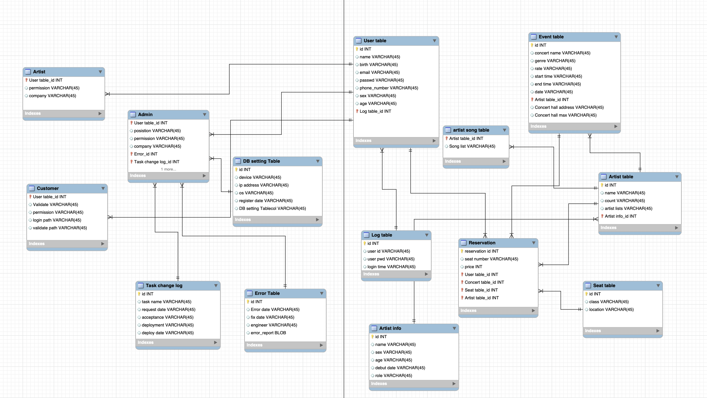

# README

This repository is about Database final project.  In this repository, there are scripts for each table and colab file(.ipynb file) and EER diagram model file.

Instead of ERD model file, I’m submitting EER diagram model file(.mwb file) and .sql file from Mysql workbench. (I used Workbench instead of ERWIN modeller because mac doesn’t supprot ERWIN modeller.)

## Environment

- SQL : Mysql 8.0.30
- SQL ide : Mysql workbench 8.0
- OS: Mac os
- Language: python 3.8, mysql

## ERD model diagram (=EER model diagram)



## Directory Tree

```bash
.
├── colab file
│   └── final term.ipynb
├── erdmodel file
│   └── erdmodel.mwb
└── sql scripts
    ├── mydb_Admin.sql
    ├── mydb_Artist.sql
    ├── mydb_ArtistInfo.sql
    ├── mydb_ArtistSongTable.sql
    ├── mydb_ArtistTable.sql
    ├── mydb_Customer.sql
    ├── mydb_DBSettingTable.sql
    ├── mydb_ErrorTable.sql
    ├── mydb_EventTable.sql
    ├── mydb_LogTable.sql
    ├── mydb_Reservation.sql
    ├── mydb_SeatTable.sql
    ├── mydb_TaskChangeLog.sql
    └── mydb_UserTable.sql
```
